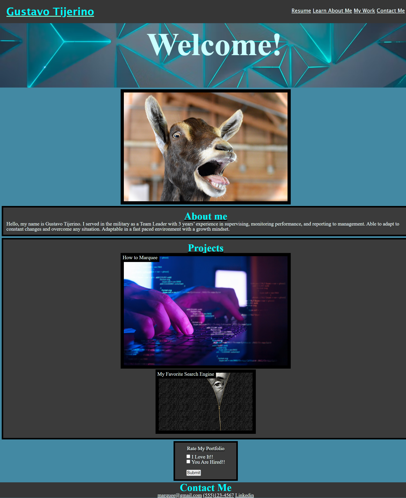

# portfoliopage2.1

## Update
I have added a favicon , my github , and the projects I have been worked on.

## Task
I created a Portfolio by using HTML and CSS. I used proper semantics such as (Main, Header, Nav, Figure,Section and Footer). On my CSS I used various of color for my text and background, I also used flexbox to structure everything on my page. I added padding and margin to give space for my items. 

## Resources 

I used some of my old work and these websites for more information "[W3 School to help me with HTML and CSS](https://www.w3schools.com/)"  "[This site helped me with many difficulties with CSS](https://stackoverflow.com/)" "[This helped me with Flexbox](https://css-tricks.com/snippets/css/a-guide-to-flexbox/)". I also had help from various classmates. 

## Final Product

## Links
[Link to my respository](https://github.com/GustavoTijerino1/portfoliopage2.1)

[Link to my Final Page](https://gustavotijerino1.github.io/portfoliopage2.1/)

